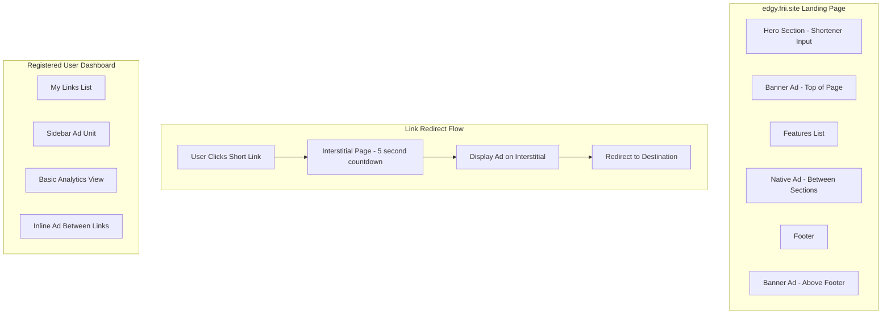
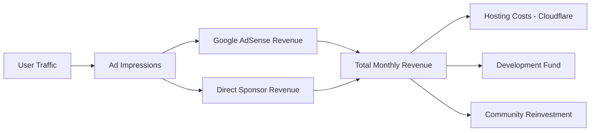
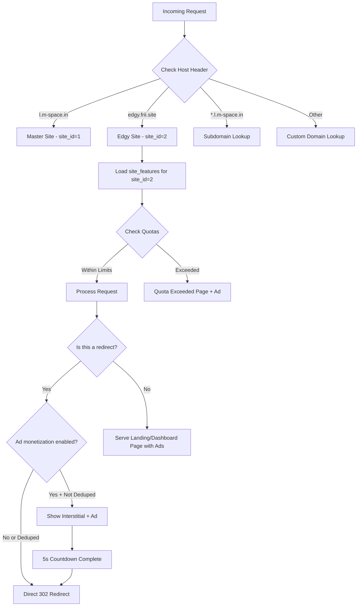

# edgy.frii.site — Site Specification

> Free-tier, fun-branded link shortener powered by the l.m-space.in backend

---

## Table of Contents

1. [Site Identity](#1-site-identity)
2. [Feature Matrix](#2-feature-matrix)
3. [Quota Limits](#3-quota-limits)
4. [Ad Strategy](#4-ad-strategy)
5. [Landing Page Design Brief](#5-landing-page-design-brief)
6. [Database & Config](#6-database--config)

---

## 1. Site Identity

### Name & Domain

- **Domain**: `edgy.frii.site`
- **Display Name**: Edgy Links
- **Tagline**: "Short links with personality — halal, free, no cap."

### Tone & Voice

- **Playful & edgy** — uses Gen-Z/internet humor, meme-adjacent language
- **Halal-compliant** — absolutely no vulgarity, profanity, sexual innuendo, or haram references
- **Inclusive** — welcoming to all, rooted in Muslim youth culture
- **Examples of acceptable tone**:
  - "Shorten your link faster than you can say Bismillah"
  - "Links so clean they could pray in a masjid"
  - "No cap, no haram, just short links"
- **Off-limits**: slang with vulgar origins, double entendres, anything mocking religion

### Target Audience

- Young Muslims aged 16–30
- Social media-active users who share links on Instagram, TikTok, Twitter, Discord
- Students, content creators, small business owners in Muslim communities
- Users who want a free tool and dont need enterprise features

### How It Differs from l.m-space.in

| Aspect | l.m-space.in | edgy.frii.site |
|--------|-------------|----------------|
| **Purpose** | Community/organizational link management | Fun free personal link shortener |
| **Audience** | Organizations, masjids, businesses | Individual young Muslims |
| **Plan** | Enterprise/master — all features | Free tier — basic features only |
| **Branding** | Professional, clean, institutional | Playful, colorful, meme-friendly |
| **Ads** | Disabled on master site | Enabled — primary revenue source |
| **Registration** | Full user management | Optional — anonymous shortening allowed |
| **Admin Panel** | Full super-admin dashboard | No admin panel — public-facing only |

---

## 2. Feature Matrix

### Feature Comparison Table

| Feature Key | l.m-space.in | edgy.frii.site | Notes |
|-------------|:------------:|:--------------:|-------|
| `public_shortening` | ✅ Enabled | ✅ Enabled | Core feature — anonymous shortening allowed |
| `custom_domains` | ✅ Unlimited | ❌ Disabled | Users cannot add custom domains |
| `ai_generation` | ✅ Enabled | ❌ Disabled | No AI features on free tier |
| `analytics` | ✅ Full | ⚠️ Basic Only | Click count + country only, no detailed breakdown |
| `api_access` | ✅ Enabled | ❌ Disabled | No API access — web UI only |
| `custom_branding` | ✅ Enabled | ❌ Disabled | Site uses edgy.frii.site branding only |
| `ad_monetization` | ❌ Disabled | ✅ Enabled | Primary revenue model for this site |
| `user_registration` | ✅ Enabled | ✅ Enabled | Optional — users CAN register for link management |
| `bulk_operations` | ✅ Enabled | ❌ Disabled | No bulk link creation/editing |
| `webhooks` | ✅ Enabled | ❌ Disabled | No webhook integrations |
| `sso` | ✅ Enabled | ❌ Disabled | No SSO — simple email/password or anonymous |
| `priority_support` | ✅ Enabled | ❌ Disabled | Community support only |

### User Registration Decision

**Decision: Enabled, but optional.**

- Anonymous users can create links without registering (subject to stricter quotas)
- Registered users get higher quotas and can manage/edit/delete their links
- Registration via email + password only (no SSO, no OAuth on free tier)
- This creates an upsell path: anonymous → registered → encourage upgrading on l.m-space.in

### Analytics — Basic Mode Config

The `analytics` feature is enabled with restricted `config_json`:

```json
{
  "level": "basic",
  "retention_days": 30,
  "allowed_metrics": ["click_count", "country", "referrer_domain"],
  "blocked_metrics": ["device_breakdown", "browser_stats", "hourly_heatmap", "utm_tracking"]
}
```

---

## 3. Quota Limits

### Quota Comparison Table

| Quota | Free — Anonymous | Free — Registered | l.m-space.in Master |
|-------|:----------------:|:-----------------:|:-------------------:|
| **Max links** | 10 | 25 | Unlimited |
| **Max clicks/month** | 500 | 1,000 | Unlimited |
| **Max custom aliases** | 0 (random only) | 5 | Unlimited |
| **Link expiry default** | 30 days | 90 days | Never |
| **Max link expiry** | 90 days | 365 days | Never |
| **Storage** | 1 MB | 5 MB | Unlimited |
| **AI credits** | 0 | 0 | Unlimited |
| **API calls/hour** | 0 | 0 | 10,000 |
| **Custom domains** | 0 | 0 | Unlimited |

### Quota Enforcement Notes

- **Anonymous users** are tracked by IP address + browser fingerprint cookie
- **Registered users** are tracked by `user_id`
- When a quota is exceeded, the user sees a friendly message encouraging registration (if anonymous) or pointing to l.m-space.in for upgraded plans
- Link expiry is enforced automatically — expired links return a "This link has expired" page with an ad placement
- Monthly click quotas reset on the 1st of each calendar month

### Quota SQL for site_quotas

```sql
-- edgy.frii.site quotas (registered user defaults)
INSERT INTO site_quotas (site_id, max_links, max_clicks_per_month, max_storage_bytes, max_ai_credits, max_api_calls_per_hour, max_custom_domains)
VALUES (
  2,    -- site_id for edgy.frii.site
  25,   -- max_links (registered)
  1000, -- max_clicks_per_month
  5242880, -- 5MB
  0,    -- no AI credits
  0,    -- no API access
  0     -- no custom domains
);
```

---

## 4. Ad Strategy

### 4.1 Ad Placement Architecture



### 4.2 Ad Placement Details

| Placement | Location | Type | Frequency |
|-----------|----------|------|-----------|
| **Landing Hero Banner** | Above shortener input | Leaderboard 728x90 | Every page load |
| **Landing Mid-Section** | Between features and CTA | Native/content ad | Every page load |
| **Landing Footer Banner** | Above footer | Banner 468x60 | Every page load |
| **Redirect Interstitial** | Full-page before redirect | Large display 300x250 or 336x280 | Every redirect (with 5s countdown) |
| **Dashboard Sidebar** | Right sidebar on link list | Skyscraper 160x600 | Every page load |
| **Dashboard Inline** | Between every 5th link | Native/in-feed ad | Every 5 links |
| **Expired Link Page** | On expired link error page | Large display 300x250 | Every view |
| **Quota Exceeded Page** | On quota limit page | Large display + CTA to upgrade | Every view |

### 4.3 Ad Frequency Rules

- **Interstitial on redirect**: shown on **every** redirect for anonymous users; every **3rd** redirect for registered users
- **Skip interstitial**: if the same user clicks the same link within 10 minutes (session-based dedup)
- **Landing page**: ads load on every page view (standard web ads)
- **Dashboard**: ads shown on every page load for free users
- **Rate limit**: maximum 1 interstitial per user per 30 seconds to avoid abuse/spam perception

### 4.4 Acceptable Ad Categories — Halal-Friendly Policy

#### ✅ Allowed Ad Categories

| Category | Examples |
|----------|---------|
| **Islamic businesses** | Halal food delivery, Islamic fashion/modest wear, prayer apps |
| **Education** | Online courses, coding bootcamps, Islamic universities, tutoring |
| **Technology** | SaaS products, VPNs, hosting, developer tools |
| **Community events** | Islamic conferences, local masjid events, charity fundraisers |
| **Halal finance** | Islamic banking, halal investment platforms, zakat calculators |
| **Health & wellness** | Fitness apps, mental health resources, halal supplements |
| **Books & media** | Islamic books, podcasts, YouTube channels, streaming |
| **Small business tools** | Canva, Shopify, email marketing, social media tools |
| **Charity & nonprofit** | Sadaqah platforms, humanitarian organizations |

#### ❌ Blocked Ad Categories (Non-Negotiable)

| Blocked Category | Google AdSense Category ID | Reason |
|------------------|---------------------------|--------|
| **Gambling & betting** | `dcl-gambling` | Haram |
| **Alcohol & tobacco** | `dcl-alcohol`, `dcl-tobacco` | Haram |
| **Adult & sexual content** | `dcl-sexual-content` | Haram / inappropriate |
| **Dating & matchmaking** | `dcl-dating` | Inappropriate for audience |
| **Pork & non-halal food** | Manual filter | Haram |
| **Interest-based finance** | Manual filter | Riba is haram |
| **Drugs & pharmaceuticals** | `dcl-drugs` | Context-inappropriate |
| **Political campaigns** | `dcl-politics` | Divisive / off-brand |
| **Weapons & violence** | `dcl-weapons` | Off-brand |
| **Cryptocurrency/NFTs** | Manual filter | High-risk / speculative (review case-by-case) |
| **Weight loss scams** | `dcl-weight-loss` | Exploitative |
| **Get-rich-quick schemes** | Manual filter | Exploitative |

### 4.5 Recommended Ad Networks & Implementation

#### Primary: Google AdSense with Category Filtering

- **Why**: largest inventory, easy setup, supports responsive ad units
- **Setup**: apply for AdSense, configure category blocking in AdSense dashboard
- **Implementation**: use AdSense auto-ads with manual placements for key slots
- **Category blocking**: block all categories listed in the blocked table above via AdSense Blocking Controls

#### Secondary: Direct Islamic Business Sponsors

- **Why**: higher CPM for targeted audience, guaranteed halal content
- **How**: reach out to Islamic businesses directly for sponsored placements
- **Model**: flat monthly fee per ad slot OR CPC-based
- **Priority placements**: landing page hero banner + redirect interstitial
- **Examples**: LaunchGood, Muslim Pro, Barakah (Islamic fintech), Modanisa

#### Tertiary: Community Ad Marketplace (Future)

- **Why**: empower Muslim small businesses to advertise affordably
- **How**: build a simple self-serve ad submission form on edgy.frii.site/advertise
- **Model**: pay-per-click with manual approval of all ad creatives
- **Review process**: all ads manually reviewed against halal policy before going live

### 4.6 Revenue Model



**Revenue streams**:

1. **Google AdSense** — CPM/CPC from programmatic ads (estimated $1–5 RPM depending on geo)
2. **Direct sponsors** — flat monthly deals with Islamic businesses ($50–500/month per slot)
3. **Upsell funnel** — users who outgrow free tier migrate to l.m-space.in paid plans

**Cost structure**:

- Cloudflare Workers: free tier covers significant traffic; Pro at $5/month if needed
- D1 database: included in Workers plan
- Domain: frii.site subdomain (minimal cost)

### 4.7 Interstitial Page Specification

The redirect interstitial page should:

1. Show the destination URL so users know where they are going
2. Display a 5-second countdown timer
3. Show one large ad unit (300x250 or 336x280)
4. Include edgy.frii.site branding and logo
5. Have a "Skip Ad" button that activates after 5 seconds
6. Include a "Report this link" button for safety
7. Be mobile-responsive (ad unit scales down on mobile)
8. Load fast — ad should not delay page render

---

## 5. Landing Page Design Brief

### 5.1 Page Sections (Top to Bottom)

```
┌──────────────────────────────────────────────┐
│  Nav: Logo | About | Dashboard (if logged in) │
├──────────────────────────────────────────────┤
│  [BANNER AD - 728x90 Leaderboard]            │
├──────────────────────────────────────────────┤
│                                              │
│  🔥 HERO SECTION                             │
│  "Short links with personality"              │
│  [ Paste your long URL here...    ] [Shorten]│
│  Result: edgy.frii.site/aBc123               │
│                                              │
├──────────────────────────────────────────────┤
│  FEATURES SECTION (3 cards)                  │
│  ⚡ Fast  |  📊 Basic Stats  |  🆓 Free     │
├──────────────────────────────────────────────┤
│  [NATIVE AD - Content-style between sections]│
├──────────────────────────────────────────────┤
│  HOW IT WORKS (3 steps)                      │
│  1. Paste  →  2. Shorten  →  3. Share        │
├──────────────────────────────────────────────┤
│  CTA: "Want more? Sign up free"              │
│  [Register] or [Login]                       │
├──────────────────────────────────────────────┤
│  [BANNER AD - 468x60]                        │
├──────────────────────────────────────────────┤
│  Footer: Links | Privacy | Terms | Powered by│
│  l.m-space.in                                │
└──────────────────────────────────────────────┘
```

### 5.2 Branding Guidelines

| Element | Specification |
|---------|--------------|
| **Primary color** | `#FF6B35` — Vibrant orange (energetic, youthful) |
| **Accent color** | `#1A1A2E` — Deep navy (trust, professionalism) |
| **Background** | `#FAFAFA` — Off-white (clean, readable) |
| **Text color** | `#1A1A2E` — Navy on light backgrounds |
| **Font — headings** | Inter Bold or Poppins Bold |
| **Font — body** | Inter Regular |
| **Logo style** | Wordmark "edgy" with a lightning bolt or fire emoji accent |
| **Border radius** | `12px` — Rounded, friendly feel |
| **Shadows** | Subtle `0 2px 8px rgba(0,0,0,0.08)` — soft elevation |
| **Emoji usage** | Encouraged in headings and feature descriptions |

### 5.3 Mobile-First Design Priorities

1. **Shortener input** must be usable with one thumb — full-width input + large button
2. **Interstitial ads** must not block the "Skip" button on small screens
3. **Banner ads** swap to 320x50 mobile banner on screens under 768px
4. **Copy-to-clipboard** button must be prominent and touch-friendly (min 44x44px tap target)
5. **Page weight** target: under 200KB initial load (excluding ads)
6. **No horizontal scroll** at any breakpoint

### 5.4 Visual Differentiation from l.m-space.in

| Aspect | l.m-space.in | edgy.frii.site |
|--------|-------------|----------------|
| **Color palette** | Green (#10b981) + Amber (#f59e0b) | Orange (#FF6B35) + Navy (#1A1A2E) |
| **Typography** | Clean, professional | Bold, playful, slightly irreverent |
| **Imagery** | Minimal, icon-based | Emoji-heavy, illustration-friendly |
| **Layout** | Dashboard-focused | Single-page app with shortener front-and-center |
| **Copy tone** | Formal, feature-focused | Casual, Gen-Z slang, meme-adjacent |
| **Animations** | Minimal | Subtle micro-interactions (confetti on shorten, etc.) |

---

## 6. Database & Config

### 6.1 Sites Table Row

```sql
INSERT INTO sites (
  subdomain,
  domain,
  display_name,
  site_type,
  parent_site_id,
  owner_user_id,
  plan_type,
  is_active,
  is_verified,
  logo_url,
  favicon_url,
  primary_color,
  accent_color,
  custom_css,
  meta_title,
  meta_description
) VALUES (
  'edgy',                              -- subdomain (edgy.l.m-space.in fallback)
  'edgy.frii.site',                    -- custom domain
  'Edgy Links',                        -- display_name
  'custom_domain',                     -- site_type
  1,                                   -- parent_site_id (master)
  1,                                   -- owner_user_id (super admin owns it)
  'free',                              -- plan_type
  1,                                   -- is_active
  1,                                   -- is_verified
  '/assets/edgy/logo.svg',            -- logo_url
  '/assets/edgy/favicon.ico',         -- favicon_url
  '#FF6B35',                           -- primary_color
  '#1A1A2E',                           -- accent_color
  NULL,                                -- custom_css (use default theme)
  'Edgy Links — Free Short Links with Personality',  -- meta_title
  'Shorten your links for free. Fast, fun, halal-friendly. No sign-up required.'  -- meta_description
);
```

### 6.2 Site Features Entries

```sql
-- Assuming edgy.frii.site gets site_id = 2

INSERT INTO site_features (site_id, feature_key, is_enabled, config_json) VALUES
-- Enabled features
(2, 'public_shortening', 1, '{"allow_anonymous": true, "anonymous_max_links": 10}'),
(2, 'analytics', 1, '{"level": "basic", "retention_days": 30, "allowed_metrics": ["click_count", "country", "referrer_domain"]}'),
(2, 'ad_monetization', 1, '{"provider": "adsense", "interstitial_enabled": true, "interstitial_delay_seconds": 5, "interstitial_frequency": "every_redirect_anon", "registered_frequency": "every_3rd_redirect"}'),
(2, 'user_registration', 1, '{"methods": ["email_password"], "require_email_verification": true}'),

-- Disabled features
(2, 'custom_domains', 0, NULL),
(2, 'ai_generation', 0, NULL),
(2, 'api_access', 0, NULL),
(2, 'custom_branding', 0, NULL),
(2, 'bulk_operations', 0, NULL),
(2, 'webhooks', 0, NULL),
(2, 'sso', 0, NULL),
(2, 'priority_support', 0, NULL);
```

### 6.3 Site Quotas Entry

```sql
INSERT INTO site_quotas (
  site_id,
  max_links,
  max_clicks_per_month,
  max_storage_bytes,
  max_ai_credits,
  max_api_calls_per_hour,
  max_custom_domains
) VALUES (
  2,        -- site_id for edgy.frii.site
  25,       -- max_links (registered default; anonymous enforced at 10 via feature config)
  1000,     -- max_clicks_per_month
  5242880,  -- 5 MB
  0,        -- no AI
  0,        -- no API
  0         -- no custom domains
);
```

### 6.4 Site Settings Entries

```sql
INSERT INTO site_settings (site_id, setting_key, setting_value, description) VALUES
(2, 'enable_ads', 'true', 'Enable ad display on this site'),
(2, 'ads_on_redirects', 'true', 'Show interstitial ads before redirecting'),
(2, 'default_link_expiry_days', '90', 'Default link expiry for registered users'),
(2, 'anonymous_link_expiry_days', '30', 'Default link expiry for anonymous users'),
(2, 'max_link_expiry_days', '365', 'Maximum allowed link expiry'),
(2, 'anonymous_max_custom_aliases', '0', 'Anonymous users get random slugs only'),
(2, 'registered_max_custom_aliases', '5', 'Registered users can set 5 custom aliases'),
(2, 'interstitial_countdown_seconds', '5', 'Seconds before skip button activates'),
(2, 'theme', 'edgy', 'UI theme identifier');
```

### 6.5 Custom Domains Entry

```sql
INSERT INTO custom_domains (
  site_id,
  domain,
  dns_status,
  ssl_status,
  is_active,
  is_primary
) VALUES (
  2,
  'edgy.frii.site',
  'verified',
  'active',
  1,
  1
);
```

### 6.6 Cloudflare DNS Setup

The following DNS records are needed:

| Record Type | Name | Content | Proxy |
|-------------|------|---------|-------|
| `CNAME` | `edgy.frii.site` | `l.m-space.in` | ✅ Proxied |

The Cloudflare Worker route must include `edgy.frii.site/*` in addition to existing routes. Update `wrangler.toml`:

```toml
# Add to existing routes
routes = [
  { pattern = "l.m-space.in/*", zone_name = "m-space.in" },
  { pattern = "edgy.frii.site/*", zone_name = "frii.site" }
]
```

---

## Appendix: Request Routing Flow



---

## Appendix: Ad Policy Review Checklist

Before any ad goes live (for direct sponsors or community marketplace), it must pass:

- [ ] No haram content (gambling, alcohol, adult, dating, riba)
- [ ] No misleading claims or get-rich-quick promises
- [ ] No political campaign content
- [ ] No weapons or violence promotion
- [ ] Image is modest and appropriate
- [ ] Landing page is safe and not deceptive
- [ ] Copy is respectful and non-exploitative
- [ ] Ad creative meets size/format requirements
- [ ] Advertiser identity is verified

---

*This document is the source of truth for the edgy.frii.site configuration. All implementation should reference these specifications.*

*Last updated: 2026-04-05*
*Related docs: [MULTISITE_ARCHITECTURE.md](./MULTISITE_ARCHITECTURE.md)*
