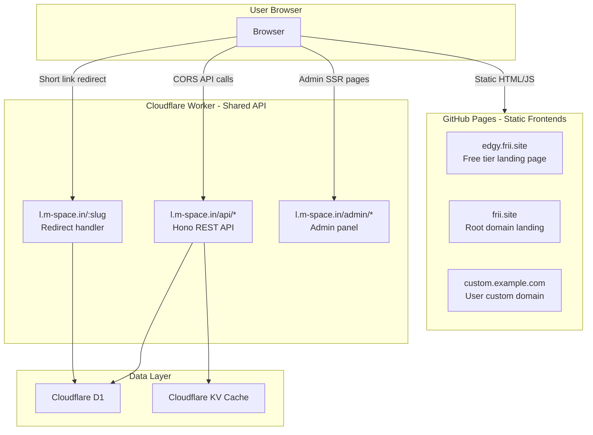
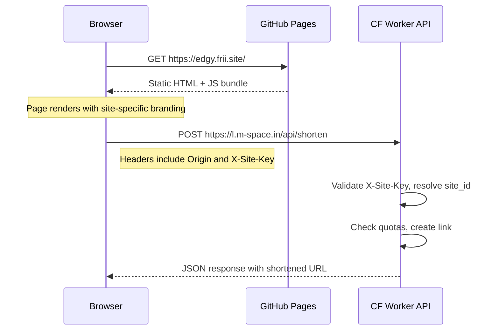
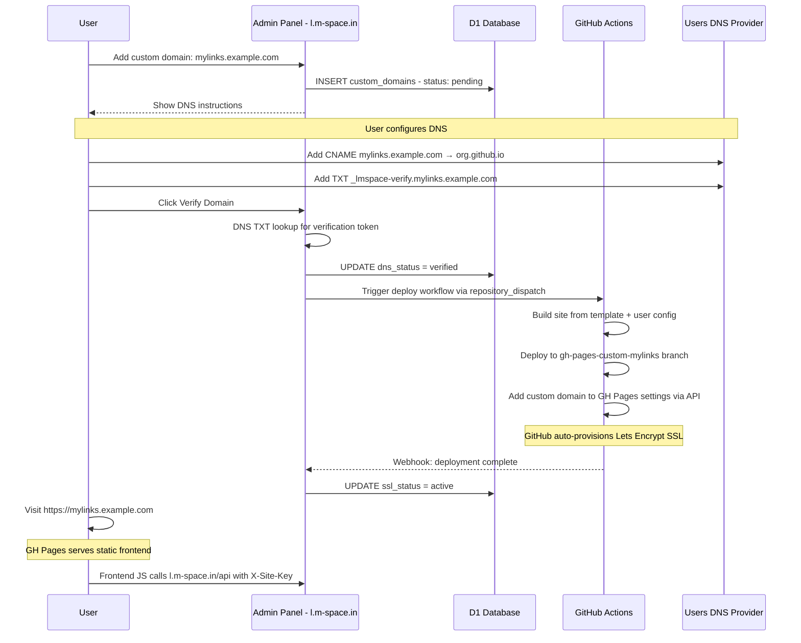
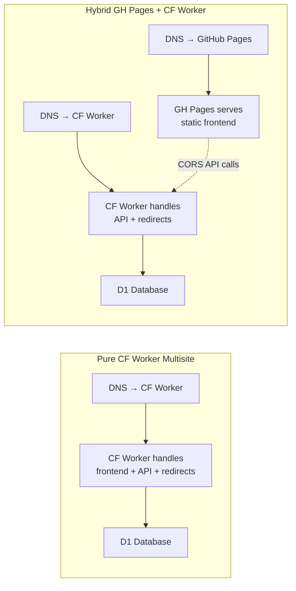

# Hybrid Multisite Architecture: GitHub Pages + Cloudflare Worker

## Overview

This document describes a **hybrid multisite architecture** where static landing page frontends are hosted on **GitHub Pages** while sharing a single **Cloudflare Worker** (`l-m-space-in`) as the backend API. This enables multiple branded sites across different domains — each with their own design, ad density, and feature set — all sharing the same link shortener API, database, and admin infrastructure.

### Key Principle

```
Frontend (HTML/CSS/JS)  →  GitHub Pages  →  per-site branding, ads, landing pages
Backend (API)           →  CF Worker     →  shared link shortener, analytics, auth
```

### Relationship to Existing Architecture

The pure CF Worker multisite design in `MULTISITE_ARCHITECTURE.md` handles **everything** in the worker — routing, frontend HTML rendering, and API logic. This hybrid architecture **separates the frontend layer** onto GitHub Pages while keeping the API layer on the CF Worker. Both architectures share the same database schema, site isolation, and feature control matrix.

---

## 1. Architecture Overview

### High-Level System Diagram



### Request Flow: Frontend Page Load



### How Site Identity is Determined

Each frontend site is registered in the `sites` table and assigned a unique **Site API Key**. The frontend includes this key in every API request:

| Method | Header / Param | Purpose |
|--------|---------------|---------|
| **Primary** | `X-Site-Key: sk_edgy_abc123...` | Unique per-site API key, set in the frontend JS config |
| **Secondary** | `Origin: https://edgy.frii.site` | Browser-sent header, used for CORS validation and cross-check |
| **Fallback** | `Referer` header | Used only as a logging/audit signal, not for auth |

The CF Worker resolves site identity with this logic:

1. Extract `X-Site-Key` header → look up `sites` table by `api_key` column
2. Validate that the `Origin` header matches the registered domain for that site
3. If both match → set `SiteContext` with the resolved `site_id`
4. If mismatch → reject with `403 Forbidden`
5. If no `X-Site-Key` → fall back to `Origin`/`Host` header resolution (backward compatible with pure CF Worker multisite)

### CORS Configuration

The current `origin: '*'` in `index.ts` must be tightened to an **allowlist**:

```typescript
// Proposed CORS configuration
app.use('/api/*', cors({
  origin: (origin) => {
    // Static allowlist for known sites
    const ALLOWED_ORIGINS = [
      'https://l.m-space.in',        // Master site (self)
      'https://edgy.frii.site',      // Free tier landing
      'https://frii.site',           // Root domain landing
      'https://www.frii.site',       // WWW variant
    ];

    if (ALLOWED_ORIGINS.includes(origin)) {
      return origin;
    }

    // Dynamic: check custom_domains table via KV cache
    // This allows user custom domains to pass CORS
    return null; // Reject unknown origins
  },
  allowMethods: ['GET', 'POST', 'PUT', 'DELETE', 'OPTIONS'],
  allowHeaders: ['Content-Type', 'Authorization', 'X-Site-Key'],
  exposeHeaders: ['X-RateLimit-Remaining'],
  maxAge: 86400,
}));
```

For **dynamic origins** (user custom domains), the worker checks the `custom_domains` table (cached in KV) to validate whether the `Origin` is a registered and verified domain.

---

## 2. DNS Configuration Pattern

### DNS Records Summary

| Domain | Record Type | Value | Proxy | Purpose |
|--------|------------|-------|-------|---------|
| `l.m-space.in` | — | CF Workers route | Proxied | **No change.** CF Worker API + admin + redirects |
| `m-space.in` | A | 23.88.7.244 | — | **DO NOT TOUCH.** Shared hosting |
| `www.m-space.in` | A | 23.88.7.244 | — | **DO NOT TOUCH.** Shared hosting |
| `frii.site` | A (x4) | 185.199.108.153<br>185.199.109.153<br>185.199.110.153<br>185.199.111.153 | — | GitHub Pages root domain |
| `www.frii.site` | CNAME | `<org>.github.io` | — | GitHub Pages www redirect |
| `edgy.frii.site` | CNAME | `<org>.github.io` | — | GitHub Pages subdomain site |
| `*.frii.site` | CNAME | `<org>.github.io` | — | Wildcard for future GH Pages sites |

### Scenario Details

#### A. `frii.site` (Root Domain) → GitHub Pages

Root/apex domains cannot use CNAME records (RFC violation). GitHub Pages supports apex domains via their dedicated A records:

```dns
; frii.site zone - Root domain to GitHub Pages
frii.site.    A    185.199.108.153
frii.site.    A    185.199.109.153
frii.site.    A    185.199.110.153
frii.site.    A    185.199.111.153

; AAAA records for IPv6
frii.site.    AAAA    2606:50c0:8000::153
frii.site.    AAAA    2606:50c0:8001::153
frii.site.    AAAA    2606:50c0:8002::153
frii.site.    AAAA    2606:50c0:8003::153
```

The `frii.site` root domain serves a **primary landing page** — a marketing/sign-up page that directs users to create their own shortener site, or links to `edgy.frii.site` for the free tier.

#### B. `edgy.frii.site` (Subdomain) → GitHub Pages

```dns
edgy.frii.site.    CNAME    <org>.github.io.
```

This is the primary "free tier" landing page with more ads, fewer features, same API backend. The GitHub Pages repo for this site has a `CNAME` file containing `edgy.frii.site`.

#### C. `*.frii.site` (Wildcard) → Future Subdomains

```dns
*.frii.site.    CNAME    <org>.github.io.
```

A wildcard CNAME allows any new `<name>.frii.site` subdomain to resolve to GitHub Pages. Each site must still have a matching `CNAME` file in its GH Pages deployment and be configured in the `sites` table.

> **Important:** GitHub Pages does not natively support wildcard custom domains. Each subdomain must be individually added to the GitHub Pages settings of the repo that serves it. The wildcard DNS simply ensures DNS resolution works — GH Pages verification is per-subdomain.

#### D. `l.m-space.in` → CF Worker (No Change)

```toml
# wrangler.toml — unchanged
routes = [{ pattern = "https://l.m-space.in/*", zone_name = "m-space.in" }]
```

This remains the API backend, admin panel, and redirect handler. No routing changes needed.

#### E. User Custom Domains → GitHub Pages (Frontend) + CF Worker (API)

User custom domains point to **GitHub Pages** for the frontend and make **cross-origin API calls** to the CF Worker:

```dns
; User sets this on their domain registrar:
mylinks.example.com    CNAME    <org>.github.io.

; Verification TXT record:
_lmspace-verify.mylinks.example.com    TXT    "site-verify=sv_abc123..."
```

The CF Worker never receives traffic directly from user custom domains — it only receives API calls with the `X-Site-Key` and `Origin` headers.

---

## 3. GitHub Pages Setup

### Recommended Repo Structure: Monorepo with Per-Site Directories

```
github.com/<org>/multisite-frontends/
├── sites/
│   ├── frii-site-root/          # frii.site root domain landing
│   │   ├── index.html
│   │   ├── CNAME               # Contains: frii.site
│   │   ├── assets/
│   │   │   ├── styles.css
│   │   │   └── app.js          # API client configured with X-Site-Key
│   │   └── config.json         # Site-specific config
│   │
│   ├── edgy-frii-site/          # edgy.frii.site free tier
│   │   ├── index.html
│   │   ├── CNAME               # Contains: edgy.frii.site
│   │   ├── assets/
│   │   │   ├── styles.css      # Heavy ad placements, different branding
│   │   │   └── app.js
│   │   └── config.json
│   │
│   └── _template/               # Template for new sites
│       ├── index.html
│       ├── assets/
│       └── config.json
│
├── shared/                      # Shared JS modules
│   ├── api-client.js            # Reusable API client for l.m-space.in
│   ├── auth.js                  # OAuth/token handling
│   └── analytics.js             # Client-side analytics helpers
│
├── .github/
│   └── workflows/
│       ├── deploy-frii-root.yml
│       ├── deploy-edgy.yml
│       └── deploy-custom.yml    # Reusable workflow for custom domains
│
└── README.md
```

### Why Monorepo Over Separate Repos

| Factor | Monorepo | Separate Repos |
|--------|----------|----------------|
| Shared code | Easy — `shared/` directory | Requires npm package or git submodule |
| CI/CD | Single workflow file per site, shared secrets | Duplicate secrets across repos |
| Custom domains | One repo can have multiple CNAME deploys via branches | Each repo = one CNAME naturally |
| Scalability | Gets unwieldy at 50+ sites | Each repo is independent |
| **Recommendation** | **Use for operator-managed sites** | **Consider for user-generated sites at scale** |

### GH Actions Workflow: Deploy a Specific Site

```yaml
# .github/workflows/deploy-edgy.yml
name: Deploy edgy.frii.site

on:
  push:
    branches: [main]
    paths:
      - 'sites/edgy-frii-site/**'
      - 'shared/**'

jobs:
  deploy:
    runs-on: ubuntu-latest
    permissions:
      contents: write
      pages: write
      id-token: write

    steps:
      - uses: actions/checkout@v4

      - name: Build site
        run: |
          # Copy shared modules into site build
          mkdir -p sites/edgy-frii-site/assets/shared
          cp shared/*.js sites/edgy-frii-site/assets/shared/

          # Inject site-specific config
          echo '{"apiBase":"https://l.m-space.in","siteKey":"sk_edgy_..."}' \
            > sites/edgy-frii-site/assets/config.json

      - name: Deploy to GitHub Pages
        uses: peaceiris/actions-gh-pages@v4
        with:
          github_token: ${{ secrets.GITHUB_TOKEN }}
          publish_dir: ./sites/edgy-frii-site
          cname: edgy.frii.site
          # Deploy to a site-specific branch
          publish_branch: gh-pages-edgy
```

### Custom Domains with GitHub Pages

Each site needs:

1. A `CNAME` file in the deploy root containing the custom domain (e.g., `edgy.frii.site`)
2. DNS records pointing to GitHub Pages (see Section 2)
3. GitHub Pages custom domain verification in the repo settings (Settings → Pages → Custom domain)
4. GitHub will auto-provision a Let's Encrypt SSL certificate

**For multiple custom domains from one repo**, deploy each site to a separate branch (e.g., `gh-pages-edgy`, `gh-pages-frii-root`) and configure GitHub Pages to serve from that branch.

### Frontend API Client Pattern

Each GH Pages site includes a shared API client that handles site identification:

```javascript
// shared/api-client.js
class LMSpaceAPI {
  constructor(config) {
    this.apiBase = config.apiBase; // https://l.m-space.in
    this.siteKey = config.siteKey; // sk_edgy_abc123...
  }

  async request(endpoint, options = {}) {
    const url = `${this.apiBase}/api${endpoint}`;
    const response = await fetch(url, {
      ...options,
      headers: {
        'Content-Type': 'application/json',
        'X-Site-Key': this.siteKey,
        ...options.headers,
      },
    });
    return response.json();
  }

  async shortenUrl(url, customAlias = null) {
    return this.request('/shorten', {
      method: 'POST',
      body: JSON.stringify({ url, custom_alias: customAlias }),
    });
  }

  async getStats(slug) {
    return this.request(`/links/${slug}/stats`);
  }
}
```

---

## 4. CF Worker Changes Needed

### 4.1 CORS Configuration Update

**Current** (in `index.ts`):
```typescript
app.use('*', cors({ origin: '*', ... }));
```

**Required**: Restrict to registered origins with dynamic lookup for custom domains:

```typescript
// New CORS middleware for API routes
app.use('/api/*', cors({
  origin: async (origin, c) => {
    const STATIC_ORIGINS = [
      'https://l.m-space.in',
      'https://edgy.frii.site',
      'https://frii.site',
    ];

    if (STATIC_ORIGINS.includes(origin)) return origin;

    // Check KV cache for custom domains
    const cached = await c.env.CACHE.get(`cors:${origin}`);
    if (cached === 'allowed') return origin;

    // Check DB for verified custom domains
    const domain = new URL(origin).hostname;
    const result = await c.env.DB.prepare(
      "SELECT 1 FROM custom_domains WHERE domain = ? AND dns_status = 'verified' AND is_active = 1"
    ).bind(domain).first();

    if (result) {
      await c.env.CACHE.put(`cors:${origin}`, 'allowed', { expirationTtl: 3600 });
      return origin;
    }

    return null; // Reject
  },
  allowHeaders: ['Content-Type', 'Authorization', 'X-Site-Key'],
  allowMethods: ['GET', 'POST', 'PUT', 'DELETE', 'OPTIONS'],
  maxAge: 86400,
}));
```

Non-API routes (`/admin/*`, `/:slug` redirects) keep broader CORS since they are server-rendered or redirects.

### 4.2 Site Identification from API Requests

Add a new `api_key` column to the `sites` table:

```sql
ALTER TABLE sites ADD COLUMN api_key TEXT UNIQUE;
CREATE INDEX idx_sites_api_key ON sites(api_key);
```

API middleware resolves site context:

```typescript
// middleware/api-site-resolver.ts
async function apiSiteResolver(c, next) {
  const siteKey = c.req.header('X-Site-Key');
  const origin = c.req.header('Origin');

  if (siteKey) {
    // Primary: resolve by API key
    const site = await lookupSiteByApiKey(c.env, siteKey);
    if (!site) return c.json({ error: 'Invalid site key' }, 401);

    // Cross-check origin if present
    if (origin && !siteOriginMatches(site, origin)) {
      return c.json({ error: 'Origin mismatch' }, 403);
    }

    c.set('site', buildSiteContext(site));
  } else {
    // Fallback: resolve by Host header (pure CF Worker mode)
    const host = c.req.header('Host');
    const site = await resolveSiteByHost(c.env, host);
    c.set('site', site ? buildSiteContext(site) : getDefaultSiteContext());
  }

  await next();
}
```

### 4.3 Route Additions in wrangler.toml

**No new routes needed.** The CF Worker stays at `l.m-space.in/*`. GH Pages frontends make cross-origin `fetch()` calls to `https://l.m-space.in/api/*`. The worker does not need to serve any `frii.site` traffic directly.

If you later want `frii.site` short links to redirect (e.g., `frii.site/abc123` → destination), you would need **either**:

- **Option A**: A second CF Worker route on `frii.site` zone (requires adding `frii.site` as a Cloudflare zone)
- **Option B**: A GH Pages JavaScript redirect that calls `l.m-space.in/api/resolve/:slug` and does `window.location = result.url`

**Recommendation**: Option B for now (no CF zone cost), Option A if redirect latency matters.

### 4.4 Does `frii.site` Need to be a Cloudflare Zone?

**Not for the initial hybrid setup.** Since `frii.site` DNS just points to GitHub Pages, it can be managed at any registrar. However, adding `frii.site` to Cloudflare provides:

| Benefit | Without CF Zone | With CF Zone |
|---------|----------------|--------------|
| Static frontend hosting | GH Pages ✓ | GH Pages ✓ (or CF Pages) |
| Direct short link redirects at `frii.site/:slug` | JS redirect only | CF Worker route ✓ |
| DDoS protection on frontend | GitHub's CDN only | Cloudflare edge ✓ |
| DNS management | External registrar | Cloudflare dashboard ✓ |
| SSL on apex domain | GH Pages auto-cert | Cloudflare Universal SSL |

**Recommendation**: Add `frii.site` to Cloudflare as a zone for unified DNS management, but keep GitHub Pages as the origin. Use Cloudflare DNS-only mode (grey cloud) for the A/CNAME records pointing to GitHub Pages.

---

## 5. Custom Domain Flow for Users

### End-to-End Flow



### Step-by-Step Breakdown

#### Step 1: User Requests Custom Domain

The user adds their domain via the admin panel at `l.m-space.in/admin`. The system:
- Generates a unique verification token (e.g., `sv_abc123def456`)
- Generates a unique site API key (e.g., `sk_mylinks_xyz789`)
- Creates a `custom_domains` record with `dns_status: pending`
- Shows the user the required DNS records

#### Step 2: DNS Configuration (User Action)

The user adds at their DNS provider:

```dns
; Frontend: point to GitHub Pages
mylinks.example.com    CNAME    <org>.github.io.

; Verification: prove domain ownership
_lmspace-verify.mylinks.example.com    TXT    "site-verify=sv_abc123def456"
```

#### Step 3: Domain Verification

When the user clicks "Verify", the CF Worker performs a DNS TXT lookup:

```typescript
// Verify via Cloudflare DNS-over-HTTPS
const resp = await fetch(
  `https://cloudflare-dns.com/dns-query?name=_lmspace-verify.${domain}&type=TXT`,
  { headers: { 'Accept': 'application/dns-json' } }
);
const data = await resp.json();
const verified = data.Answer?.some(a => a.data.includes(token));
```

#### Step 4: GitHub Actions Deploys the Site

After verification, the admin triggers a GitHub Actions workflow via `repository_dispatch`:

```typescript
// Trigger GH Actions from CF Worker
await fetch('https://api.github.com/repos/<org>/multisite-frontends/dispatches', {
  method: 'POST',
  headers: {
    'Authorization': `Bearer ${env.GITHUB_PAT}`,
    'Accept': 'application/vnd.github.v3+json',
  },
  body: JSON.stringify({
    event_type: 'deploy-custom-domain',
    client_payload: {
      domain: 'mylinks.example.com',
      site_key: 'sk_mylinks_xyz789',
      site_id: 42,
      template: 'default', // or 'edgy', 'minimal', etc.
    },
  }),
});
```

The GH Actions workflow:
1. Copies the template site
2. Injects the site's API key and config
3. Deploys to a branch named `gh-pages-custom-mylinks-example-com`
4. Sets the custom domain via the GitHub Pages API

#### Step 5: SSL Provisioning

- **GitHub Pages**: Automatically provisions Let's Encrypt certificates for verified custom domains. No action needed from the CF Worker.
- **Cloudflare (for API)**: Already has SSL on `l.m-space.in`. Cross-origin API calls use HTTPS end-to-end.
- **User's domain**: SSL is handled entirely by GitHub Pages. The user does not need to configure SSL themselves.

#### Step 6: Ongoing Operation

The custom domain site is now live:
- `https://mylinks.example.com` → GitHub Pages serves static HTML
- JavaScript on the page calls `https://l.m-space.in/api/*` with `X-Site-Key` header
- The CF Worker resolves the site context and enforces quotas/features

### GH Actions Reusable Workflow for Custom Domains

```yaml
# .github/workflows/deploy-custom.yml
name: Deploy Custom Domain Site

on:
  repository_dispatch:
    types: [deploy-custom-domain]

jobs:
  deploy:
    runs-on: ubuntu-latest
    steps:
      - uses: actions/checkout@v4

      - name: Build custom site
        run: |
          DOMAIN="${{ github.event.client_payload.domain }}"
          SITE_KEY="${{ github.event.client_payload.site_key }}"
          TEMPLATE="${{ github.event.client_payload.template }}"
          BRANCH="gh-pages-custom-$(echo $DOMAIN | tr '.' '-')"

          # Copy template
          cp -r "sites/_template" "build"

          # Inject config
          cat > build/assets/config.json << EOF
          {
            "apiBase": "https://l.m-space.in",
            "siteKey": "${SITE_KEY}",
            "domain": "${DOMAIN}"
          }
          EOF

          # Set CNAME
          echo "${DOMAIN}" > build/CNAME

      - name: Deploy to GitHub Pages
        uses: peaceiris/actions-gh-pages@v4
        with:
          github_token: ${{ secrets.GITHUB_TOKEN }}
          publish_dir: ./build
          publish_branch: gh-pages-custom-${{ github.event.client_payload.domain }}
          cname: ${{ github.event.client_payload.domain }}
```

---

## 6. Comparison: Pure CF Worker vs. Hybrid GH Pages + CF Worker

### Architecture Comparison



### Detailed Comparison

| Aspect | Pure CF Worker | Hybrid GH Pages + CF Worker |
|--------|---------------|---------------------------|
| **Frontend hosting** | CF Worker SSR (views/*.ts) | GitHub Pages static files |
| **Branding flexibility** | Limited to template variables in Hono views | Full HTML/CSS/JS freedom per site |
| **Custom domains — frontend** | Requires CF zone per domain + worker route | CNAME to github.io, GH auto-SSL |
| **Custom domains — cost** | $0 (CF free tier) but needs zone management | $0 (GH Pages free tier) |
| **Redirect latency** | ~10ms (CF edge, same worker) | ~50-200ms if JS redirect through API; ~10ms if also routed through CF |
| **Admin panel** | Served by the same worker | Stays on CF Worker at l.m-space.in/admin |
| **CORS complexity** | None (same-origin) | Must configure and maintain allowlist |
| **Site identity** | Host header (simple) | X-Site-Key header + Origin validation |
| **Deployment** | Single wrangler deploy | wrangler deploy + GH Actions per site |
| **Offline/CDN** | CF edge cache only | GitHub CDN + potential service worker |
| **Ad injection** | Server-side injection on redirect pages | Client-side injection (more flexible, harder to block) |
| **SEO/landing pages** | Limited, worker-rendered HTML | Full static site with SEO optimization |
| **Scalability for frontends** | All sites share worker compute | Static sites scale independently on GH CDN |
| **Developer experience** | TypeScript templates in worker | Standard HTML/CSS/JS or any static site generator |

### When to Use Each

#### Use Pure CF Worker When:
- The site is primarily a **URL shortener redirect service** (minimal frontend)
- You need **sub-10ms redirect latency** for short links on the custom domain
- You want a **single deployment pipeline** with no external dependencies
- The frontend is **identical across sites** (just different config variables)
- You control the domain's Cloudflare zone already

#### Use Hybrid GH Pages + CF Worker When:
- Each site needs **significantly different branding/design** (e.g., edgy.frii.site vs l.m-space.in)
- You want **rich landing pages** with custom HTML, SEO, and marketing content
- You want **free SSL and hosting** via GitHub Pages for the frontend
- The site is **read-heavy** with landing pages that don't need server rendering
- You want to let **users/resellers manage their own frontend** while sharing the API
- You have **many custom domains** and want to avoid managing a CF zone per domain

#### Recommended Hybrid Approach

Use **both** architectures simultaneously:

| Site | Architecture | Reason |
|------|-------------|--------|
| `l.m-space.in` | Pure CF Worker | Master site, admin panel, main redirects |
| `*.l.m-space.in` | Pure CF Worker | Subdomain tenants using shared worker UI |
| `edgy.frii.site` | Hybrid GH Pages + CF Worker | Different branding, more ads, landing page |
| `frii.site` | Hybrid GH Pages + CF Worker | Marketing/sign-up landing page |
| User custom domains | Hybrid GH Pages + CF Worker | Users get static frontend, API calls to worker |

Short link redirects (e.g., `edgy.frii.site/abc123`) can be handled two ways:
1. **Client-side redirect**: GH Pages serves a 404.html that reads the slug from the URL path and calls the API to resolve it, then redirects via JavaScript. Adds ~100-200ms latency.
2. **CF Worker redirect**: If `frii.site` is added as a CF zone, add a worker route for `frii.site/*` and `*.frii.site/*` to handle redirects at the edge. Sub-10ms latency.

**Phase 1** (immediate): Use client-side redirect via GH Pages 404.html.
**Phase 2** (when latency matters): Add CF zone for `frii.site` and route redirect traffic through the worker.

---

## Appendix A: Required Secrets and Environment Variables

### GitHub Repository Secrets (multisite-frontends repo)

| Secret | Purpose |
|--------|---------|
| `GITHUB_TOKEN` | Auto-provided, for GH Pages deployment |
| (optional) `CF_API_TOKEN` | If triggering CF Worker cache purge after deploy |

### CF Worker Environment Variables

| Variable | Purpose |
|----------|---------|
| `GITHUB_PAT` | GitHub Personal Access Token for triggering `repository_dispatch` |
| `CORS_ALLOWED_ORIGINS` | Comma-separated static allowlist (supplementary to DB lookup) |

### Per-Site Config (in frontend config.json)

| Key | Example | Purpose |
|-----|---------|---------|
| `apiBase` | `https://l.m-space.in` | CF Worker API base URL |
| `siteKey` | `sk_edgy_abc123...` | Site API key for X-Site-Key header |
| `domain` | `edgy.frii.site` | The sites own domain (for display/canonical) |

---

## Appendix B: GH Pages 404.html Redirect Handler

For handling short link redirects on GH Pages domains (e.g., `edgy.frii.site/abc123`):

```html
<!-- 404.html — Deployed to every GH Pages site -->
<!DOCTYPE html>
<html>
<head>
  <meta charset="utf-8">
  <title>Redirecting...</title>
  <script>
    (async () => {
      const slug = window.location.pathname.slice(1);
      if (!slug || slug.includes('/')) {
        // Not a short link, show 404
        document.getElementById('msg').textContent = 'Page not found';
        return;
      }

      try {
        const config = await fetch('/assets/config.json').then(r => r.json());
        const resp = await fetch(`${config.apiBase}/api/resolve/${slug}`, {
          headers: { 'X-Site-Key': config.siteKey },
        });

        if (resp.ok) {
          const data = await resp.json();
          window.location.replace(data.url);
        } else {
          document.getElementById('msg').textContent = 'Link not found';
        }
      } catch (e) {
        document.getElementById('msg').textContent = 'Error resolving link';
      }
    })();
  </script>
</head>
<body>
  <p id="msg">Redirecting...</p>
</body>
</html>
```

This requires the CF Worker to expose a `GET /api/resolve/:slug` endpoint that returns the destination URL without performing the redirect itself.

---

## Appendix C: New API Endpoint Needed on CF Worker

```typescript
// GET /api/resolve/:slug — Returns URL without redirecting
// Used by GH Pages frontends for client-side redirect
apiRoutes.get('/resolve/:slug', async (c) => {
  const site = c.get('site');
  const slug = c.req.param('slug');

  const link = await db.get(
    'SELECT url, redirect_type FROM links WHERE site_id = ? AND slug = ? AND is_active = 1',
    [site.siteId, slug]
  );

  if (!link) return c.json({ error: 'Not found' }, 404);

  // Record click
  await recordClick(c, link.id, site.siteId);

  return c.json({ url: link.url, redirect_type: link.redirect_type });
});
```

---

*Document Version: 1.0*
*Last Updated: 2026-04-05*
*Author: Architect Mode*
*Related: [MULTISITE_ARCHITECTURE.md](./MULTISITE_ARCHITECTURE.md) — Pure CF Worker multisite design*
