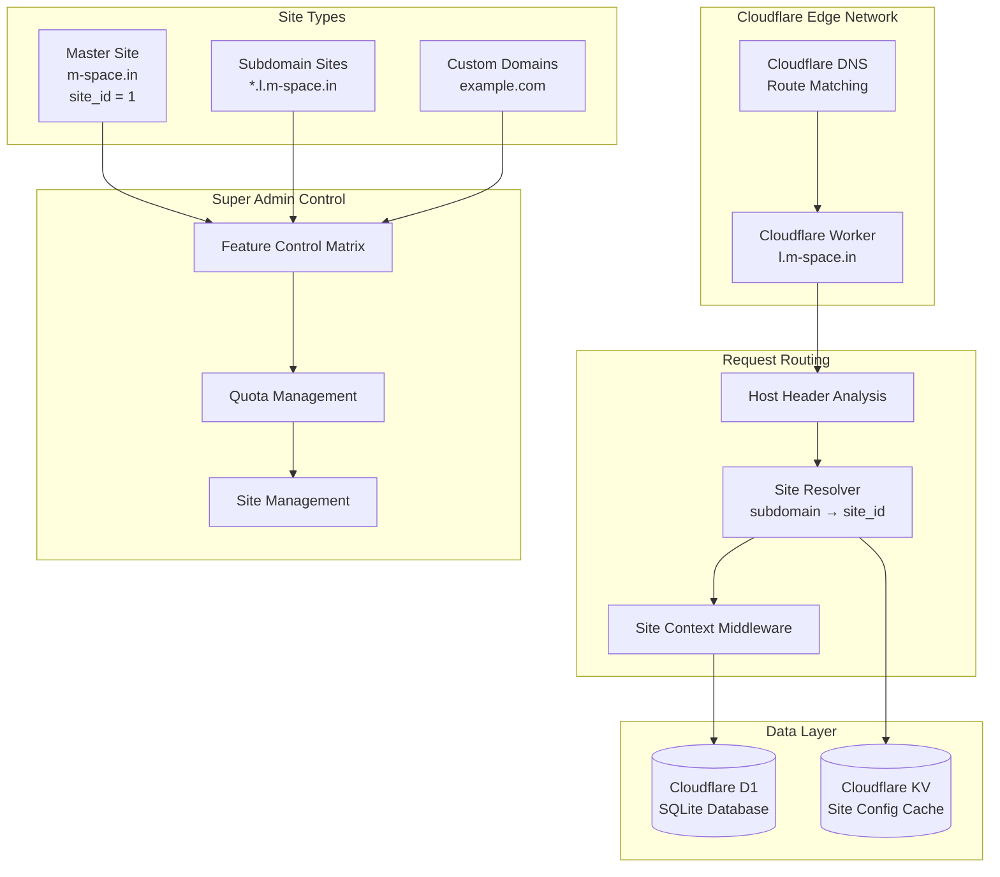
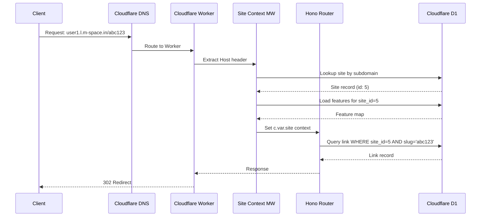

# WordPress Multisite-like Architecture for l.m-space.in

## Overview

This document defines the multisite architecture for the Hono-based Cloudflare Worker URL shortener. The system enables a master/root site (m-space.in) with super admin control over child sites on subdomains or custom domains.

## Architecture Goals

- **Tenant Isolation**: Each site operates independently with isolated data
- **Feature Control**: Super admin can enable/disable features per site
- **Quota Management**: Enforce limits based on subscription plans
- **Custom Domains**: Support CNAME-based custom domain mapping
- **Scalability**: Efficient query performance with site_id filtering

---

## System Architecture



---

## Database Schema

### 1. Sites Table (Tenant Registry)

```sql
-- Sites table - Core tenant registry
CREATE TABLE sites (
    id INTEGER PRIMARY KEY AUTOINCREMENT,
    -- Site identification
    subdomain TEXT UNIQUE,                    -- e.g., 'user1', 'edgymemes', null for master
    domain TEXT UNIQUE,                       -- Custom domain, e.g., 'edgymemes.int.yt'
    display_name TEXT NOT NULL,               -- Human-readable site name
    
    -- Site type and hierarchy
    site_type TEXT NOT NULL CHECK(site_type IN ('master', 'subdomain', 'custom_domain')) DEFAULT 'subdomain',
    parent_site_id INTEGER,                   -- For future site hierarchies
    
    -- Ownership and access
    owner_user_id INTEGER NOT NULL,           -- Reference to users.id
    
    -- Plan and billing
    plan_type TEXT NOT NULL CHECK(plan_type IN ('free', 'basic', 'pro', 'enterprise')) DEFAULT 'free',
    plan_expires_at DATETIME,                 -- When the current plan expires
    
    -- Status
    is_active INTEGER DEFAULT 1,              -- Site can be suspended
    is_verified INTEGER DEFAULT 0,            -- Email/domain verification status
    suspension_reason TEXT,                   -- Why site was suspended
    
    -- Branding
    logo_url TEXT,                            -- Custom logo
    favicon_url TEXT,                         -- Custom favicon
    primary_color TEXT DEFAULT '#10b981',     -- Brand color
    accent_color TEXT DEFAULT '#f59e0b',      -- Accent color
    custom_css TEXT,                          -- Custom CSS overrides
    
    -- SEO and metadata
    meta_title TEXT,                          -- Custom title tag
    meta_description TEXT,                    -- Custom meta description
    
    -- Timestamps
    created_at DATETIME DEFAULT CURRENT_TIMESTAMP,
    updated_at DATETIME DEFAULT CURRENT_TIMESTAMP,
    
    -- Foreign keys
    FOREIGN KEY (owner_user_id) REFERENCES users(id) ON DELETE RESTRICT,
    FOREIGN KEY (parent_site_id) REFERENCES sites(id) ON DELETE SET NULL
);

-- Indexes for site lookups
CREATE INDEX idx_sites_subdomain ON sites(subdomain);
CREATE INDEX idx_sites_domain ON sites(domain);
CREATE INDEX idx_sites_owner ON sites(owner_user_id);
CREATE INDEX idx_sites_plan ON sites(plan_type);
CREATE INDEX idx_sites_active ON sites(is_active);
```

### 2. Site Features Table (Feature Control Matrix)

```sql
-- Site features table - Per-site feature toggles
CREATE TABLE site_features (
    id INTEGER PRIMARY KEY AUTOINCREMENT,
    site_id INTEGER NOT NULL,
    feature_key TEXT NOT NULL,
    is_enabled INTEGER DEFAULT 0,
    
    -- Override values (nullable, uses default if null)
    config_json TEXT,                         -- JSON blob for feature-specific config
    
    -- Timestamps
    created_at DATETIME DEFAULT CURRENT_TIMESTAMP,
    updated_at DATETIME DEFAULT CURRENT_TIMESTAMP,
    
    -- Constraints
    UNIQUE(site_id, feature_key),
    FOREIGN KEY (site_id) REFERENCES sites(id) ON DELETE CASCADE
);

-- Index for feature lookups
CREATE INDEX idx_site_features_site ON site_features(site_id);
CREATE INDEX idx_site_features_key ON site_features(feature_key);
```

### 3. Site Quotas Table (Usage Tracking)

```sql
-- Site quotas table - Usage tracking and limits
CREATE TABLE site_quotas (
    id INTEGER PRIMARY KEY AUTOINCREMENT,
    site_id INTEGER NOT NULL UNIQUE,
    
    -- Link limits
    max_links INTEGER DEFAULT 50,             -- Maximum total links
    links_used INTEGER DEFAULT 0,             -- Current link count
    
    -- Click/redirect limits (monthly)
    max_clicks_per_month INTEGER DEFAULT 1000,
    clicks_this_month INTEGER DEFAULT 0,
    clicks_reset_at DATETIME,                 -- When the counter resets
    
    -- Storage limits (in bytes)
    max_storage_bytes INTEGER DEFAULT 10485760,  -- 10MB default
    storage_used_bytes INTEGER DEFAULT 0,
    
    -- AI credits (monthly)
    max_ai_credits INTEGER DEFAULT 10,
    ai_credits_used INTEGER DEFAULT 0,
    ai_credits_reset_at DATETIME,
    
    -- API rate limits
    max_api_calls_per_hour INTEGER DEFAULT 100,
    api_calls_this_hour INTEGER DEFAULT 0,
    api_calls_reset_at DATETIME,
    
    -- Custom domains allowed
    max_custom_domains INTEGER DEFAULT 0,
    custom_domains_used INTEGER DEFAULT 0,
    
    -- Timestamps
    created_at DATETIME DEFAULT CURRENT_TIMESTAMP,
    updated_at DATETIME DEFAULT CURRENT_TIMESTAMP,
    
    FOREIGN KEY (site_id) REFERENCES sites(id) ON DELETE CASCADE
);

CREATE INDEX idx_site_quotas_site ON site_quotas(site_id);
```

### 4. Site Users Table (Site Membership)

```sql
-- Site users junction table - User membership per site
CREATE TABLE site_users (
    id INTEGER PRIMARY KEY AUTOINCREMENT,
    site_id INTEGER NOT NULL,
    user_id INTEGER NOT NULL,
    
    -- Role within this site (different from global user role)
    site_role TEXT NOT NULL CHECK(site_role IN ('site_admin', 'site_editor', 'site_viewer')) DEFAULT 'site_editor',
    
    -- Permissions override (JSON array of permission keys)
    permissions_json TEXT,
    
    -- Status
    is_active INTEGER DEFAULT 1,
    invited_by INTEGER,                       -- Who added this user
    invited_at DATETIME,
    
    -- Timestamps
    created_at DATETIME DEFAULT CURRENT_TIMESTAMP,
    updated_at DATETIME DEFAULT CURRENT_TIMESTAMP,
    
    UNIQUE(site_id, user_id),
    FOREIGN KEY (site_id) REFERENCES sites(id) ON DELETE CASCADE,
    FOREIGN KEY (user_id) REFERENCES users(id) ON DELETE CASCADE,
    FOREIGN KEY (invited_by) REFERENCES users(id) ON DELETE SET NULL
);

CREATE INDEX idx_site_users_site ON site_users(site_id);
CREATE INDEX idx_site_users_user ON site_users(user_id);
CREATE INDEX idx_site_users_role ON site_users(site_role);
```

### 5. Site Settings Table (Site-specific Config)

```sql
-- Site settings table - Override global settings per site
CREATE TABLE site_settings (
    id INTEGER PRIMARY KEY AUTOINCREMENT,
    site_id INTEGER NOT NULL,
    setting_key TEXT NOT NULL,
    setting_value TEXT,
    
    -- Metadata
    is_encrypted INTEGER DEFAULT 0,           -- For sensitive values
    description TEXT,                         -- Human-readable description
    
    -- Timestamps
    created_at DATETIME DEFAULT CURRENT_TIMESTAMP,
    updated_at DATETIME DEFAULT CURRENT_TIMESTAMP,
    
    UNIQUE(site_id, setting_key),
    FOREIGN KEY (site_id) REFERENCES sites(id) ON DELETE CASCADE
);

CREATE INDEX idx_site_settings_site ON site_settings(site_id);
CREATE INDEX idx_site_settings_key ON site_settings(setting_key);
```

### 6. Modified Existing Tables

```sql
-- Add site_id to existing tables for isolation
ALTER TABLE links ADD COLUMN site_id INTEGER DEFAULT 1;
ALTER TABLE links ADD COLUMN created_by_site_user_id INTEGER;
ALTER TABLE clicks ADD COLUMN site_id INTEGER DEFAULT 1;
ALTER TABLE tags ADD COLUMN site_id INTEGER DEFAULT 1;
ALTER TABLE handles ADD COLUMN site_id INTEGER DEFAULT 1;
ALTER TABLE activity_log ADD COLUMN site_id INTEGER DEFAULT 1;

-- Create indexes for site-scoped queries
CREATE INDEX idx_links_site ON links(site_id);
CREATE INDEX idx_clicks_site ON clicks(site_id);
CREATE INDEX idx_tags_site ON tags(site_id);
CREATE INDEX idx_handles_site ON handles(site_id);
CREATE INDEX idx_activity_site ON activity_log(site_id);
```

### 7. Custom Domains Table

```sql
-- Custom domains table for CNAME mapping
CREATE TABLE custom_domains (
    id INTEGER PRIMARY KEY AUTOINCREMENT,
    site_id INTEGER NOT NULL,
    domain TEXT UNIQUE NOT NULL,              -- e.g., 'edgymemes.int.yt'
    
    -- DNS and SSL status
    dns_status TEXT CHECK(dns_status IN ('pending', 'verified', 'failed')) DEFAULT 'pending',
    ssl_status TEXT CHECK(ssl_status IN ('pending', 'active', 'failed')) DEFAULT 'pending',
    
    -- Validation
    validation_token TEXT,                    -- DNS TXT record token
    validated_at DATETIME,
    
    -- Cloudflare integration
    cloudflare_zone_id TEXT,                  -- CF Zone ID for automation
    cloudflare_dns_record_id TEXT,            -- CF DNS record ID
    
    -- Status
    is_active INTEGER DEFAULT 1,
    is_primary INTEGER DEFAULT 0,             -- Primary domain for this site
    
    -- Timestamps
    created_at DATETIME DEFAULT CURRENT_TIMESTAMP,
    updated_at DATETIME DEFAULT CURRENT_TIMESTAMP,
    
    FOREIGN KEY (site_id) REFERENCES sites(id) ON DELETE CASCADE
);

CREATE INDEX idx_custom_domains_site ON custom_domains(site_id);
CREATE INDEX idx_custom_domains_domain ON custom_domains(domain);
CREATE INDEX idx_custom_domains_status ON custom_domains(dns_status, ssl_status);
```

---

## Feature Control Matrix

### Available Features

| Feature Key | Description | Default (Free) | Basic | Pro | Enterprise |
|-------------|-------------|----------------|-------|-----|------------|
| `public_shortening` | Allow anonymous URL shortening | ✓ | ✓ | ✓ | ✓ |
| `custom_domains` | Add custom CNAME domains | ✗ | 1 | 3 | Unlimited |
| `ai_generation` | AI content generation | ✗ | ✓ | ✓ | ✓ |
| `analytics` | Detailed click analytics | Limited | ✓ | ✓ | ✓ |
| `api_access` | REST API access | ✗ | ✓ | ✓ | ✓ |
| `custom_branding` | Custom logo/colors | ✗ | ✓ | ✓ | ✓ |
| `ad_monetization` | Show ads on redirects | ✓ | ✓ | ✓ | ✗ |
| `user_registration` | Allow user registration | ✗ | ✓ | ✓ | ✓ |
| `bulk_operations` | Bulk link operations | ✗ | ✗ | ✓ | ✓ |
| `webhooks` | Webhook integrations | ✗ | ✗ | ✓ | ✓ |
| `sso` | Single sign-on | ✗ | ✗ | ✗ | ✓ |
| `priority_support` | Priority support | ✗ | ✗ | ✓ | ✓ |

### Feature Definition SQL

```sql
-- Insert default features (run once during setup)
INSERT INTO site_features (site_id, feature_key, is_enabled, config_json) VALUES
-- Master site (ID 1) - all features enabled
(1, 'public_shortening', 1, '{"allow_anonymous": true}'),
(1, 'custom_domains', 1, '{"max_domains": 999999}'),
(1, 'ai_generation', 1, '{"provider": "openai"}'),
(1, 'analytics', 1, '{"retention_days": 365}'),
(1, 'api_access', 1, '{"rate_limit": 10000}'),
(1, 'custom_branding', 1, '{}'),
(1, 'ad_monetization', 0, '{}'),
(1, 'user_registration', 1, '{}'),
(1, 'bulk_operations', 1, '{}'),
(1, 'webhooks', 1, '{}'),
(1, 'sso', 1, '{}'),
(1, 'priority_support', 1, '{}');
```

---

## Plan/Quota System

### Plan Definitions

```typescript
// Plan configuration object
const PLAN_CONFIGS = {
  free: {
    max_links: 50,
    max_clicks_per_month: 1000,
    max_storage_bytes: 10 * 1024 * 1024,  // 10MB
    max_ai_credits: 0,
    max_api_calls_per_hour: 50,
    max_custom_domains: 0,
    features: ['public_shortening', 'ad_monetization']
  },
  basic: {
    max_links: 500,
    max_clicks_per_month: 10000,
    max_storage_bytes: 100 * 1024 * 1024,  // 100MB
    max_ai_credits: 50,
    max_api_calls_per_hour: 500,
    max_custom_domains: 1,
    features: ['public_shortening', 'custom_domains', 'ai_generation', 
               'analytics', 'api_access', 'custom_branding', 'user_registration']
  },
  pro: {
    max_links: 5000,
    max_clicks_per_month: 100000,
    max_storage_bytes: 1024 * 1024 * 1024,  // 1GB
    max_ai_credits: 500,
    max_api_calls_per_hour: 2000,
    max_custom_domains: 3,
    features: ['public_shortening', 'custom_domains', 'ai_generation', 
               'analytics', 'api_access', 'custom_branding', 'user_registration',
               'bulk_operations', 'webhooks', 'priority_support']
  },
  enterprise: {
    max_links: -1,  // Unlimited
    max_clicks_per_month: -1,
    max_storage_bytes: -1,
    max_ai_credits: -1,
    max_api_calls_per_hour: 10000,
    max_custom_domains: -1,
    features: ['public_shortening', 'custom_domains', 'ai_generation', 
               'analytics', 'api_access', 'custom_branding', 'user_registration',
               'bulk_operations', 'webhooks', 'sso', 'priority_support']
  }
};
```

### Quota Enforcement Strategy

```typescript
// Quota check helper
async function checkQuota(
  db: DbHelper, 
  siteId: number, 
  quotaType: 'links' | 'clicks' | 'storage' | 'ai_credits' | 'api_calls'
): Promise<{ allowed: boolean; remaining: number; limit: number }> {
  const quota = await db.get<SiteQuota>(
    'SELECT * FROM site_quotas WHERE site_id = ?',
    [siteId]
  );
  
  if (!quota) return { allowed: false, remaining: 0, limit: 0 };
  
  // Check if counters need reset
  const now = new Date();
  if (quota.clicks_reset_at && new Date(quota.clicks_reset_at) < now) {
    // Reset monthly counters
    await db.run(
      `UPDATE site_quotas 
       SET clicks_this_month = 0, 
           ai_credits_used = 0,
           clicks_reset_at = datetime('now', '+1 month'),
           ai_credits_reset_at = datetime('now', '+1 month')
       WHERE site_id = ?`,
      [siteId]
    );
  }
  
  // Similar check for hourly API calls
  if (quota.api_calls_reset_at && new Date(quota.api_calls_reset_at) < now) {
    await db.run(
      `UPDATE site_quotas SET api_calls_this_hour = 0, api_calls_reset_at = datetime('now', '+1 hour') WHERE site_id = ?`,
      [siteId]
    );
  }
  
  // Check specific quota
  switch (quotaType) {
    case 'links':
      return {
        allowed: quota.max_links === -1 || quota.links_used < quota.max_links,
        remaining: quota.max_links === -1 ? Infinity : quota.max_links - quota.links_used,
        limit: quota.max_links
      };
    case 'clicks':
      return {
        allowed: quota.max_clicks_per_month === -1 || quota.clicks_this_month < quota.max_clicks_per_month,
        remaining: quota.max_clicks_per_month === -1 ? Infinity : quota.max_clicks_per_month - quota.clicks_this_month,
        limit: quota.max_clicks_per_month
      };
    // ... other cases
  }
}
```

---

## Site Isolation Strategy

### 1. Row-Level Security Pattern

All database queries must include `site_id` filtering:

```typescript
// Bad - No site isolation
const links = await db.all('SELECT * FROM links WHERE slug = ?', [slug]);

// Good - Site-scoped query
const links = await db.all('SELECT * FROM links WHERE site_id = ? AND slug = ?', [siteId, slug]);
```

### 2. Site Context Middleware

```typescript
// middleware/site-context.ts
import { Hono } from 'hono';
import type { Env } from '../config';

export interface SiteContext {
  siteId: number;
  subdomain: string | null;
  domain: string | null;
  isMaster: boolean;
  features: Map<string, boolean>;
  planType: string;
}

// Extend Hono context
declare module 'hono' {
  interface ContextVariableMap {
    site: SiteContext;
  }
}

export async function siteContextMiddleware(c: Context<{ Bindings: Env }>, next: Next) {
  const host = c.req.header('host') || '';
  const db = createDbHelper(c.env.DB);
  
  // Parse hostname
  const site = await resolveSite(db, host);
  
  if (!site) {
    return c.json({ error: 'Site not found' }, 404);
  }
  
  if (!site.is_active) {
    return c.json({ error: 'Site suspended', reason: site.suspension_reason }, 403);
  }
  
  // Load enabled features
  const features = await loadSiteFeatures(db, site.id);
  
  // Set context
  c.set('site', {
    siteId: site.id,
    subdomain: site.subdomain,
    domain: site.domain,
    isMaster: site.site_type === 'master',
    features,
    planType: site.plan_type
  });
  
  await next();
}

async function resolveSite(db: DbHelper, host: string): Promise<Site | null> {
  // Remove port if present
  host = host.split(':')[0];
  
  // Check for custom domain
  let site = await db.get<Site>(
    `SELECT s.* FROM sites s
     JOIN custom_domains cd ON cd.site_id = s.id
     WHERE cd.domain = ? AND cd.is_active = 1 AND cd.dns_status = 'verified'`,
    [host]
  );
  
  if (site) return site;
  
  // Check for subdomain pattern: *.l.m-space.in
  const subdomainMatch = host.match(/^([^.]+)\.l\.m-space\.in$/);
  if (subdomainMatch) {
    site = await db.get<Site>(
      'SELECT * FROM sites WHERE subdomain = ? AND is_active = 1',
      [subdomainMatch[1]]
    );
    if (site) return site;
  }
  
  // Check for master domain
  if (host === 'l.m-space.in' || host === 'm-space.in') {
    return await db.get<Site>(
      "SELECT * FROM sites WHERE site_type = 'master' LIMIT 1"
    );
  }
  
  return null;
}
```

### 3. Service Layer Integration

```typescript
// services/links.ts - Updated for multisite
export function createLinksService(db: DbHelper, siteContext: SiteContext) {
  return {
    async getBySlug(slug: string): Promise<Link | null> {
      return db.get<Link>(
        'SELECT * FROM links WHERE site_id = ? AND slug = ? AND is_active = 1',
        [siteContext.siteId, slug]
      );
    },
    
    async create(data: CreateLinkInput): Promise<Link> {
      // Check feature enabled
      if (!siteContext.features.get('public_shortening') && !data.userId) {
        throw new Error('Anonymous shortening disabled for this site');
      }
      
      // Check quota
      const quota = await checkQuota(db, siteContext.siteId, 'links');
      if (!quota.allowed) {
        throw new Error(`Link quota exceeded. Limit: ${quota.limit}`);
      }
      
      // Create link with site_id
      const result = await db.run(
        `INSERT INTO links (site_id, slug, url, title, created_by, ...)
         VALUES (?, ?, ?, ?, ?, ...)`,
        [siteContext.siteId, data.slug, data.url, data.title, data.userId]
      );
      
      // Increment quota usage
      await db.run(
        'UPDATE site_quotas SET links_used = links_used + 1 WHERE site_id = ?',
        [siteContext.siteId]
      );
      
      return this.getById(result.lastInsertRowid!);
    }
  };
}
```

---

## Cloudflare Workers Routing Strategy

### 1. DNS Configuration

```
; DNS Records for m-space.in zone

; Master domain
l.m-space.in        A       192.0.2.1
m-space.in          A       192.0.2.1

; Wildcard for subdomains
*.l.m-space.in      CNAME   l.m-space.in
```

### 2. Wrangler Configuration

```toml
# wrangler.toml - Updated for multisite

name = "l-m-space-in"
compatibility_date = "2024-12-01"
main = "src/index.ts"

# Routes - Master domain and wildcard
routes = [
  { pattern = "https://l.m-space.in/*", zone_name = "m-space.in" },
  { pattern = "https://*.l.m-space.in/*", zone_name = "m-space.in" }
]

# Custom domains handled dynamically via API

[vars]
SITE_URL = "https://l.m-space.in"
MASTER_SITE_ID = "1"

[[d1_databases]]
binding = "DB"
database_name = "l-m-space-in"
database_id = "314bb374-df3a-43f6-b3a0-3410969191b2"

[[kv_namespaces]]
binding = "CACHE"
id = "c3d8bf393b2b47bdb0dbe96e63e9cfdf"
```

### 3. Request Routing Flow



### 4. Custom Domain SSL/DNS Automation

```typescript
// services/domains.ts
export function createDomainService(db: DbHelper, env: Env) {
  return {
    async addCustomDomain(siteId: number, domain: string): Promise<CustomDomain> {
      // Check quota
      const quota = await checkQuota(db, siteId, 'custom_domains');
      if (!quota.allowed) {
        throw new Error('Custom domain quota exceeded');
      }
      
      // Generate validation token
      const validationToken = crypto.randomUUID();
      
      // Create record
      const result = await db.run(
        `INSERT INTO custom_domains (site_id, domain, validation_token, dns_status)
         VALUES (?, ?, ?, 'pending')`,
        [siteId, domain, validationToken]
      );
      
      // Trigger Cloudflare zone creation (async)
      await this.provisionCloudflareZone(domain);
      
      return this.getDomain(result.lastInsertRowid!);
    },
    
    async verifyDomain(domainId: number): Promise<boolean> {
      const domain = await this.getDomain(domainId);
      
      // Check DNS TXT record
      const txtRecords = await this.queryDNS(domain.domain, 'TXT');
      const isValid = txtRecords.some(r => r.includes(domain.validation_token!));
      
      if (isValid) {
        await db.run(
          `UPDATE custom_domains 
           SET dns_status = 'verified', validated_at = CURRENT_TIMESTAMP 
           WHERE id = ?`,
          [domainId]
        );
        
        // Provision SSL certificate
        await this.provisionSSL(domain.domain);
        
        // Add to Worker routes
        await this.addWorkerRoute(domain.domain);
      }
      
      return isValid;
    },
    
    async provisionCloudflareZone(domain: string): Promise<void> {
      // Use Cloudflare API to create zone
      // Requires CF_API_TOKEN with Zone:Edit permissions
      const response = await fetch('https://api.cloudflare.com/client/v4/zones', {
        method: 'POST',
        headers: {
          'Authorization': `Bearer ${env.CF_API_TOKEN}`,
          'Content-Type': 'application/json'
        },
        body: JSON.stringify({
          name: domain,
          jump_start: true
        })
      });
      
      const data = await response.json();
      // Store zone_id in database
    }
  };
}
```

---

## Super Admin Control Panel

### 1. UI Structure

```
/admin/super/
├── /sites              # Site management list
│   ├── GET  /          # List all sites with filters
│   ├── POST /          # Create new site
│   ├── GET  /:id       # Site details
│   ├── PUT  /:id       # Update site
│   └── POST /:id/suspend  # Suspend/activate site
│
├── /features           # Global feature defaults
│   ├── GET  /          # List all feature definitions
│   └── PUT  /:key      # Update feature default
│
├── /quotas             # Plan/quota management
│   ├── GET  /          # List plan configurations
│   └── PUT  /:plan     # Update plan limits
│
└── /domains            # Custom domain management
    ├── GET  /          # List pending/verified domains
    └── POST /:id/verify  # Manually verify domain
```

### 2. Site Management Page Wireframe

```
┌─────────────────────────────────────────────────────────────────┐
│  Super Admin ▼          m-space Link Shortener          🔍 👤   │
├─────────────────────────────────────────────────────────────────┤
│                                                                 │
│  SITES MANAGEMENT                                    [+ New Site]│
│  ═══════════════════════════════════════════════════════════   │
│                                                                 │
│  ┌──────────────┐  ┌──────────────┐  ┌──────────────┐         │
│  │ Total Sites  │  │ Active       │  │ Suspended    │         │
│  │     127      │  │     118      │  │      9       │         │
│  └──────────────┘  └──────────────┘  └──────────────┘         │
│                                                                 │
│  Filter: [All Sites ▼] [All Plans ▼] [Search...    ] 🔍        │
│                                                                 │
│  ┌──────────────────────────────────────────────────────────┐  │
│  │ Site              │ Plan  │ Status  │ Usage    │ Actions │  │
│  ├──────────────────────────────────────────────────────────┤  │
│  │ 🏠 m-space.in     │ Master│ Active  │ 45K links│ ⚙️ 👁️ ✏️ │  │
│  │ ──────────────────────────────────────────────────────── │  │
│  │ 🔗 edgymemes      │ Pro   │ Active  │ 2.3K/5K  │ ⚙️ 👁️ ✏️ │  │
│  │    l.m-space.in   │       │         │ links    │         │  │
│  │ ──────────────────────────────────────────────────────── │  │
│  │ 🔗 user1          │ Free  │ Active  │ 48/50    │ ⚙️ 👁️ ✏️ │  │
│  │    l.m-space.in   │       │         │ links    │         │  │
│  │ ──────────────────────────────────────────────────────── │  │
│  │ 🔗 spam-site      │ Free  │Suspended│ 0 links  │ ⚙️ 👁️ ✏️ │  │
│  │    l.m-space.in   │       │Abuse    │          │         │  │
│  └──────────────────────────────────────────────────────────┘  │
│                                                                 │
│              ←  1  2  3  ...  13  →                            │
│                                                                 │
└─────────────────────────────────────────────────────────────────┘
```

### 3. Feature Control Page Wireframe

```
┌─────────────────────────────────────────────────────────────────┐
│  Site: edgymemes.l.m-space.in           [Back to Sites]  👤    │
├─────────────────────────────────────────────────────────────────┤
│                                                                 │
│  FEATURE CONTROL MATRIX                              [💾 Save]  │
│  ═══════════════════════════════════════════════════════════   │
│                                                                 │
│  Plan: Pro (inherited)  │  Custom overrides: 3 enabled         │
│                                                                 │
│  ┌──────────────────────────────────────────────────────────┐  │
│  │ Feature                    │ Plan    │ Override │ Status  │  │
│  ├──────────────────────────────────────────────────────────┤  │
│  │ Public URL Shortening      │ ✓ On    │  ─       │ ✅ On   │  │
│  │ Custom Domains             │ 3 max   │  ─       │ ✅ 2/3  │  │
│  │ AI Content Generation      │ ✓ On    │ [✓ Toggle]│ 🟡 On  │  │
│  │ Analytics/Statistics       │ Full    │  ─       │ ✅ Full │  │
│  │ API Access                 │ ✓ On    │  ─       │ ✅ On   │  │
│  │ Custom Branding            │ ✓ On    │  ─       │ ✅ On   │  │
│  │ Ad Monetization            │ ✗ Off   │ [✓ Toggle]│ 🟡 On  │  │
│  │ User Registration          │ ✓ On    │  ─       │ ✅ On   │  │
│  │ Bulk Operations            │ ✓ On    │  ─       │ ✅ On   │  │
│  │ Webhooks                   │ ✓ On    │ [✗ Toggle]│ 🟡 Off │  │
│  └──────────────────────────────────────────────────────────┘  │
│                                                                 │
│  Legend: ✅ Inherited  🟡 Custom override  ─ Not configurable   │
│                                                                 │
└─────────────────────────────────────────────────────────────────┘
```

### 4. API Endpoints for Super Admin

```typescript
// routes/admin-super.ts
const superAdminRoutes = new Hono<{ Bindings: Env }>();

// Require super admin role
superAdminRoutes.use('*', requireSuperAdmin);

// Sites CRUD
superAdminRoutes.get('/sites', async (c) => {
  const { page = '1', limit = '20', status, plan, search } = c.req.query();
  const db = createDbHelper(c.env.DB);
  
  let sql = `
    SELECT s.*, 
           u.email as owner_email,
           u.name as owner_name,
           q.links_used, q.max_links,
           q.clicks_this_month, q.max_clicks_per_month,
           COUNT(cd.id) as custom_domain_count
    FROM sites s
    JOIN users u ON u.id = s.owner_user_id
    LEFT JOIN site_quotas q ON q.site_id = s.id
    LEFT JOIN custom_domains cd ON cd.site_id = s.id AND cd.is_active = 1
    WHERE 1=1
  `;
  const params: any[] = [];
  
  if (status) {
    sql += ' AND s.is_active = ?';
    params.push(status === 'active' ? 1 : 0);
  }
  
  if (plan) {
    sql += ' AND s.plan_type = ?';
    params.push(plan);
  }
  
  if (search) {
    sql += ' AND (s.display_name LIKE ? OR s.subdomain LIKE ? OR u.email LIKE ?)';
    params.push(`%${search}%`, `%${search}%`, `%${search}%`);
  }
  
  sql += ' GROUP BY s.id ORDER BY s.created_at DESC LIMIT ? OFFSET ?';
  params.push(parseInt(limit), (parseInt(page) - 1) * parseInt(limit));
  
  const sites = await db.all(sql, params);
  return c.json({ sites, page: parseInt(page), limit: parseInt(limit) });
});

// Update site features
superAdminRoutes.put('/sites/:id/features/:key', async (c) => {
  const siteId = parseInt(c.req.param('id'));
  const featureKey = c.req.param('key');
  const { is_enabled, config_json } = await c.req.json();
  
  const db = createDbHelper(c.env.DB);
  
  await db.run(
    `INSERT INTO site_features (site_id, feature_key, is_enabled, config_json)
     VALUES (?, ?, ?, ?)
     ON CONFLICT(site_id, feature_key) DO UPDATE SET
       is_enabled = excluded.is_enabled,
       config_json = excluded.config_json,
       updated_at = CURRENT_TIMESTAMP`,
    [siteId, featureKey, is_enabled ? 1 : 0, config_json]
  );
  
  // Clear cache
  await c.env.CACHE.delete(`site:${siteId}:features`);
  
  return c.json({ success: true });
});

// Suspend/Reactivate site
superAdminRoutes.post('/sites/:id/suspend', async (c) => {
  const siteId = parseInt(c.req.param('id'));
  const { suspend, reason } = await c.req.json();
  
  const db = createDbHelper(c.env.DB);
  
  await db.run(
    `UPDATE sites SET 
       is_active = ?, 
       suspension_reason = ?,
       updated_at = CURRENT_TIMESTAMP
     WHERE id = ?`,
    [suspend ? 0 : 1, suspend ? reason : null, siteId]
  );
  
  // Log action
  await db.run(
    'INSERT INTO activity_log (site_id, user_id, action, details) VALUES (?, ?, ?, ?)',
    [siteId, c.get('user').id, suspend ? 'site_suspended' : 'site_activated', reason]
  );
  
  // Clear all caches for this site
  await c.env.CACHE.delete(`site:${siteId}`);
  await c.env.CACHE.delete(`site:${siteId}:features`);
  
  return c.json({ success: true, site_id: siteId, status: suspend ? 'suspended' : 'active' });
});

// Update plan/quotas
superAdminRoutes.put('/sites/:id/quota', async (c) => {
  const siteId = parseInt(c.req.param('id'));
  const updates = await c.req.json();
  
  const db = createDbHelper(c.env.DB);
  
  // Build dynamic update
  const fields = Object.keys(updates).filter(k => k.startsWith('max_') || k.endsWith('_used'));
  if (fields.length === 0) {
    return c.json({ error: 'No valid quota fields provided' }, 400);
  }
  
  const setClause = fields.map(f => `${f} = ?`).join(', ');
  const values = fields.map(f => updates[f]);
  
  await db.run(
    `UPDATE site_quotas SET ${setClause}, updated_at = CURRENT_TIMESTAMP WHERE site_id = ?`,
    [...values, siteId]
  );
  
  // If plan_type changed, update sites table
  if (updates.plan_type) {
    await db.run(
      'UPDATE sites SET plan_type = ?, updated_at = CURRENT_TIMESTAMP WHERE id = ?',
      [updates.plan_type, siteId]
    );
  }
  
  return c.json({ success: true });
});
```

---

## Migration Path from Single-Site to Multisite

### Migration Steps

```sql
-- 005_multisite_migration.sql

-- Step 1: Create master site (site_id = 1)
INSERT INTO sites (
    id, subdomain, domain, display_name, site_type, 
    owner_user_id, plan_type, is_active, is_verified
) VALUES (
    1, NULL, 'l.m-space.in', 'm-space Link Shortener', 'master',
    1, 'enterprise', 1, 1
);

-- Step 2: Migrate existing links to site_id = 1
UPDATE links SET site_id = 1 WHERE site_id IS NULL;
UPDATE clicks SET site_id = 1 WHERE site_id IS NULL;
UPDATE tags SET site_id = 1 WHERE site_id IS NULL;
UPDATE handles SET site_id = 1 WHERE site_id IS NULL;
UPDATE activity_log SET site_id = 1 WHERE site_id IS NULL;

-- Step 3: Create default quota for master site
INSERT INTO site_quotas (
    site_id, max_links, max_clicks_per_month, max_storage_bytes,
    max_ai_credits, max_api_calls_per_hour, max_custom_domains
) VALUES (
    1, -1, -1, -1, -1, 10000, -1
);

-- Step 4: Enable all features for master site
INSERT INTO site_features (site_id, feature_key, is_enabled)
SELECT 1, feature_key, 1 FROM (
    SELECT 'public_shortening' as feature_key UNION ALL
    SELECT 'custom_domains' UNION ALL
    SELECT 'ai_generation' UNION ALL
    SELECT 'analytics' UNION ALL
    SELECT 'api_access' UNION ALL
    SELECT 'custom_branding' UNION ALL
    SELECT 'ad_monetization' UNION ALL
    SELECT 'user_registration' UNION ALL
    SELECT 'bulk_operations' UNION ALL
    SELECT 'webhooks' UNION ALL
    SELECT 'sso' UNION ALL
    SELECT 'priority_support'
);

-- Step 5: Insert site_users for existing users
INSERT INTO site_users (site_id, user_id, site_role, is_active)
SELECT 1, id, 
    CASE role 
        WHEN 'owner' THEN 'site_admin'
        WHEN 'admin' THEN 'site_admin'
        ELSE 'site_editor'
    END,
    1
FROM users;

-- Step 6: Set NOT NULL constraint on site_id columns
-- Note: SQLite doesn't support ALTER COLUMN, recreate tables if needed
-- For now, application code handles NULL as 1
```

### Application Migration Strategy

```typescript
// config.ts - Backward compatibility
export interface Env {
  DB: D1Database;
  CACHE: KVNamespace;
  MASTER_SITE_ID?: string;  // Defaults to "1"
}

// db/index.ts - Default site context
export function getDefaultSiteContext(): SiteContext {
  return {
    siteId: 1,
    subdomain: null,
    domain: 'l.m-space.in',
    isMaster: true,
    features: new Map([/* all features enabled */]),
    planType: 'enterprise'
  };
}

// Middleware graceful fallback
export async function siteContextMiddleware(c: Context, next: Next) {
  try {
    // Try to resolve site
    const site = await resolveSite(db, host);
    
    if (site) {
      c.set('site', await buildSiteContext(site));
    } else {
      // Fallback to master site for backward compatibility
      c.set('site', getDefaultSiteContext());
    }
  } catch (error) {
    // If multisite tables don't exist yet, use defaults
    c.set('site', getDefaultSiteContext());
  }
  
  await next();
}
```

---

## Caching Strategy

### KV Cache Structure

```
CACHE Keys:

site:{domain} → { site_id, subdomain, plan_type, expires }
site:{subdomain}.l.m-space.in → { site_id, subdomain, plan_type, expires }
site:{site_id}:features → { feature_key: is_enabled, ... }
site:{site_id}:quota → { max_links, links_used, ... }
site:{site_id}:settings → { key: value, ... }

ttl: 5 minutes for features/quotas, 1 hour for site resolution
```

### Cache Invalidation

```typescript
// Cache helpers
export async function invalidateSiteCache(cache: KVNamespace, siteId: number, domain?: string) {
  const promises = [
    cache.delete(`site:${siteId}:features`),
    cache.delete(`site:${siteId}:quota`),
    cache.delete(`site:${siteId}:settings`),
  ];
  
  if (domain) {
    promises.push(cache.delete(`site:${domain}`));
  }
  
  await Promise.all(promises);
}
```

---

## Security Considerations

### 1. Subdomain Validation

```typescript
// Prevent subdomain squatting and reserved words
const RESERVED_SUBDOMAINS = [
  'www', 'admin', 'api', 'app', 'mail', 'ftp', 'smtp', 'pop', 'imap',
  'ns1', 'ns2', 'dns', 'host', 'server', 'web', 'www1', 'www2',
  'master', 'root', 'super', 'support', 'help', 'docs', 'blog',
  'test', 'staging', 'dev', 'local', 'localhost', 'demo'
];

function validateSubdomain(subdomain: string): boolean {
  // Only alphanumeric and hyphens
  if (!/^[a-z0-9-]+$/.test(subdomain)) return false;
  
  // No leading/trailing hyphens
  if (subdomain.startsWith('-') || subdomain.endsWith('-')) return false;
  
  // Length check
  if (subdomain.length < 3 || subdomain.length > 63) return false;
  
  // Reserved words
  if (RESERVED_SUBDOMAINS.includes(subdomain.toLowerCase())) return false;
  
  return true;
}
```

### 2. Site Authorization Checks

```typescript
// middleware/authorization.ts
export function requireSitePermission(permission: string) {
  return async (c: Context, next: Next) => {
    const site = c.get('site');
    const user = c.get('user');
    
    // Master site owner has all permissions
    if (site.isMaster && user.role === 'owner') {
      return next();
    }
    
    // Check site-specific permissions
    const siteUser = await db.get<SiteUser>(
      'SELECT * FROM site_users WHERE site_id = ? AND user_id = ? AND is_active = 1',
      [site.siteId, user.id]
    );
    
    if (!siteUser) {
      return c.json({ error: 'Not a member of this site' }, 403);
    }
    
    // Check permission
    const hasPermission = await checkPermission(siteUser, permission);
    if (!hasPermission) {
      return c.json({ error: 'Permission denied' }, 403);
    }
    
    await next();
  };
}
```

---

## Performance Considerations

### 1. Database Query Optimization

```sql
-- Composite indexes for common queries
CREATE INDEX idx_links_site_slug ON links(site_id, slug);
CREATE INDEX idx_links_site_active ON links(site_id, is_active, created_at);
CREATE INDEX idx_clicks_site_date ON clicks(site_id, clicked_at);
CREATE INDEX idx_activity_site_action ON activity_log(site_id, action, created_at);
```

### 2. Read Replicas (Future)

For high-traffic sites, consider:
- Cloudflare D1 read replicas (when available)
- KV caching for frequently accessed data
- Edge-side rendering with stale-while-revalidate

### 3. Rate Limiting per Site

```typescript
// Rate limiting keyed by site_id
async function rateLimitBySite(c: Context, limit: number, window: number) {
  const site = c.get('site');
  const key = `ratelimit:${site.siteId}:${c.req.ip}`;
  
  const current = await c.env.CACHE.get(key);
  const count = current ? parseInt(current) : 0;
  
  if (count >= limit) {
    return c.json({ error: 'Rate limit exceeded' }, 429);
  }
  
  await c.env.CACHE.put(key, String(count + 1), { expirationTtl: window });
}
```

---

## Implementation Checklist

### Phase 1: Database Schema
- [ ] Create migration file (005_multisite.sql)
- [ ] Add sites table
- [ ] Add site_features table
- [ ] Add site_quotas table
- [ ] Add site_users table
- [ ] Add custom_domains table
- [ ] Modify existing tables (add site_id columns)
- [ ] Create indexes

### Phase 2: Core Infrastructure
- [ ] Create SiteContext types and middleware
- [ ] Implement site resolution logic
- [ ] Create feature checking helpers
- [ ] Implement quota enforcement
- [ ] Set up KV caching for sites/features

### Phase 3: Service Layer Updates
- [ ] Update links service for site isolation
- [ ] Update analytics service for site scoping
- [ ] Update auth service for site membership
- [ ] Create domain management service

### Phase 4: Super Admin UI
- [ ] Create super admin routes
- [ ] Build sites management page
- [ ] Build feature control matrix UI
- [ ] Build quota management page
- [ ] Build domain verification UI

### Phase 5: Routing & Domains
- [ ] Configure Cloudflare wildcard DNS
- [ ] Implement custom domain resolution
- [ ] Create domain provisioning service
- [ ] Add SSL automation

### Phase 6: Migration & Testing
- [ ] Run migration on staging
- [ ] Test backward compatibility
- [ ] Verify site isolation
- [ ] Test feature toggles
- [ ] Load test with multiple sites

---

## Appendix: TypeScript Interfaces

```typescript
// types/multisite.ts

export interface Site {
  id: number;
  subdomain: string | null;
  domain: string | null;
  display_name: string;
  site_type: 'master' | 'subdomain' | 'custom_domain';
  parent_site_id: number | null;
  owner_user_id: number;
  plan_type: 'free' | 'basic' | 'pro' | 'enterprise';
  plan_expires_at: string | null;
  is_active: number;
  is_verified: number;
  suspension_reason: string | null;
  logo_url: string | null;
  favicon_url: string | null;
  primary_color: string;
  accent_color: string;
  custom_css: string | null;
  meta_title: string | null;
  meta_description: string | null;
  created_at: string;
  updated_at: string;
}

export interface SiteFeature {
  id: number;
  site_id: number;
  feature_key: string;
  is_enabled: number;
  config_json: string | null;
  created_at: string;
  updated_at: string;
}

export interface SiteQuota {
  id: number;
  site_id: number;
  max_links: number;
  links_used: number;
  max_clicks_per_month: number;
  clicks_this_month: number;
  clicks_reset_at: string | null;
  max_storage_bytes: number;
  storage_used_bytes: number;
  max_ai_credits: number;
  ai_credits_used: number;
  ai_credits_reset_at: string | null;
  max_api_calls_per_hour: number;
  api_calls_this_hour: number;
  api_calls_reset_at: string | null;
  max_custom_domains: number;
  custom_domains_used: number;
  created_at: string;
  updated_at: string;
}

export interface SiteUser {
  id: number;
  site_id: number;
  user_id: number;
  site_role: 'site_admin' | 'site_editor' | 'site_viewer';
  permissions_json: string | null;
  is_active: number;
  invited_by: number | null;
  invited_at: string | null;
  created_at: string;
  updated_at: string;
}

export interface CustomDomain {
  id: number;
  site_id: number;
  domain: string;
  dns_status: 'pending' | 'verified' | 'failed';
  ssl_status: 'pending' | 'active' | 'failed';
  validation_token: string | null;
  validated_at: string | null;
  cloudflare_zone_id: string | null;
  cloudflare_dns_record_id: string | null;
  is_active: number;
  is_primary: number;
  created_at: string;
  updated_at: string;
}

// Feature keys enum
export type FeatureKey =
  | 'public_shortening'
  | 'custom_domains'
  | 'ai_generation'
  | 'analytics'
  | 'api_access'
  | 'custom_branding'
  | 'ad_monetization'
  | 'user_registration'
  | 'bulk_operations'
  | 'webhooks'
  | 'sso'
  | 'priority_support';
```

---

*Document Version: 1.0*
*Last Updated: 2026-04-05*
*Author: Architect Mode*
